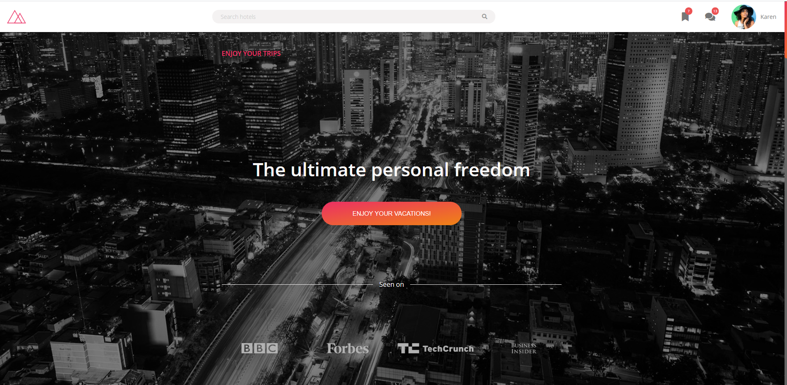

#  🧐 trillo responsive

> This is a page made with HTML and Sass, we made it ultra responsive so it has some amazing mediaqueries.


<meta property="og:image" content="https://github.com/Ceci007/image-repository/blob/master/trillo.jpg?raw=true#keepProtocol">

## 🔧 Built With

- HTML
- Sass (a CSS preprocesor).
- Using flexbox and CSS grid.
- Using mediaqueris for Responsive Design.

## 🔴 Live Demo

[Live Demo](https://ceci007.github.io/trillo-responsive/)


## 🛠 Getting Started

To get a local copy up and running follow these simple example steps.

- Go to the main page of te repo.
- Press the ```Code``` button and get the repo link.
- Clone it using git.

## ✒️ Authors

👤 **Cecilia Benitez**

- [@Ceci007](https://github.com/Ceci007)
- [LinkenIn](https://www.linkedin.com/in/cecilia-ben%C3%ADtez-casaccia-498669185/)


## 🤝 Contributing

Contributions, issues and feature requests are welcome!

Feel free to check the [issues page](issues/).

## 📝 License

This project is [MIT](lic.url) licensed.
